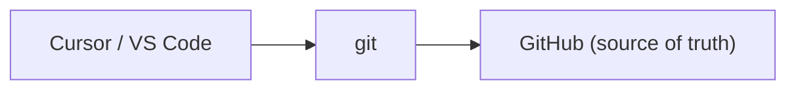
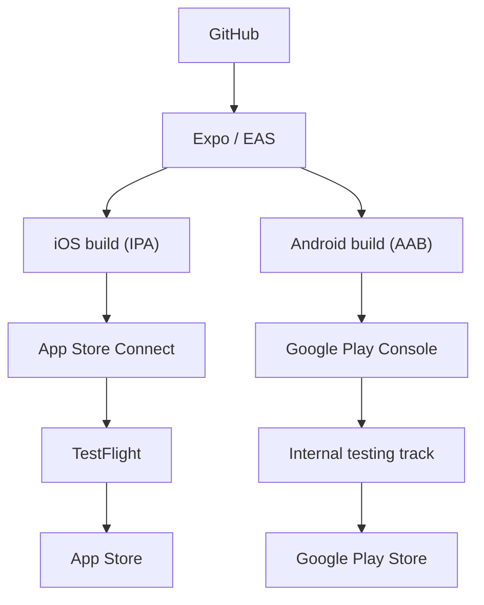
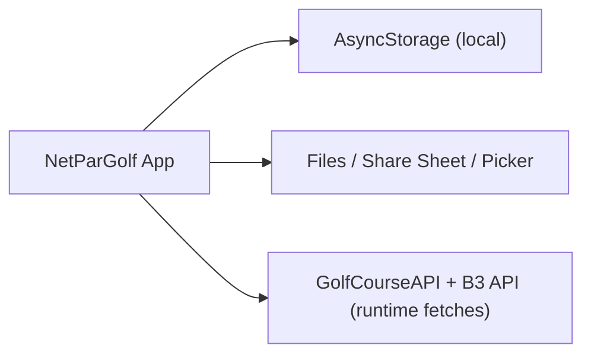

# NetParGolf Platform Map

This document is the operational and architecture map for NetParGolf across development, build/release, runtime services, and device storage.

## 1) Development

- Editor: Cursor / VS Code
- Source control: git
- Remote repository: GitHub (`TheTowerUK/netpargolf`)
- Package source: npm registry (Expo, React Native, React Navigation, TypeScript, and other dependencies)



## 2) Build & Release

NetParGolf uses Expo/EAS for cloud builds and store submission.

- EAS Build profiles: `development`, `preview`, `production`
- EAS Submit configured for iOS in `eas.json`
- iOS pipeline: Apple Developer -> App Store Connect -> TestFlight -> App Store
- Android pipeline: EAS Build (AAB) -> Google Play Console -> Internal Testing/Production tracks -> Google Play Store
- Signing handled by EAS credentials flow:
  - iOS certificates/profiles
  - Android keystore



## 3) Runtime Services

### External APIs

- GolfCourseAPI (`https://api.golfcourseapi.com`)
  - Course search
  - Tee data
  - Course rating / slope / par data
- B3 Golf UK (`https://api.bthree.uk/golf/v1`)
  - UK fallback course/hole data
  - Stroke index fallback path where available

### Secrets

- `GOLF_COURSE_API_KEY`
  - Injected via EAS/environment into Expo config (`app.config.js`)

### Current telemetry posture

- No dedicated analytics SDK configured
- No dedicated crash reporting SDK configured

## 4) User Device

NetParGolf is currently local-first.

- Primary storage: AsyncStorage
- Local data includes:
  - Courses
  - Round state/history
  - Competition setup drafts/preferences
- File/share surfaces:
  - Share sheet (PDF and other exports where enabled)
  - Document picker (imports where enabled)



## 5) Identifiers

- Expo project ID: `6bd586fc-83e4-4edf-8812-cfac752b1494`
- Expo slug: `netpargolf`
- iOS bundle identifier: `com.thetower.netpargolf`
- Android package: `com.thetoweruk.netpargolf`
- App Store Connect app ID: `6759217492`
- Apple team ID: `UV8WX5DTDN`

## 6) Release Commands (cheat sheet)

```bash
# Source control
git add .
git commit -m "release prep"
git push

# Build
eas build --platform ios --profile production
eas build --platform android --profile production

# Submit
eas submit --platform ios --profile production
# Android submit flow can be enabled/configured similarly when required
```

## Notes

- Keep this file updated whenever:
  - build profiles change
  - new platform integrations are added (analytics, crash reporting, cloud sync)
  - store identifiers or package IDs change
